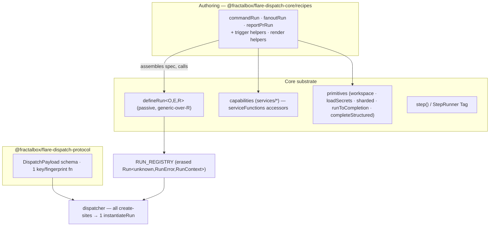

# FlareDispatch — New-Repo Build Plan

**Decision (made): incremental refactor over rewrite.** We keep the proven substrate and build the combinator tier its architecture already implies, porting into this new repo across **5 PRs**. We do *not* redesign the DSL from scratch.

> This is a greenfield build in a fresh repo, so there is no live production branch to protect — the in-place-refactor risk apparatus (regression-via-existing-tests, main-branch drift, staged safety) does not apply. What survives is a small set of design decisions the build must get right, folded into the relevant PRs below.

---

## 1. What we keep, what we add

The DSL **core** is good and load-bearing — we port it as-is in spirit:

- `capability → primitive → recipe` layering, enforced by the two entry points.
- A `Run` is a portable value bound to no runtime; `defineRun` is a passive constructor (a total function of its spec), so anything that assembles a spec and calls it produces a `Run` **indistinguishable to the dispatcher** — it registers unchanged and executes against the same Layer graph.
- The `StepRunner` Tag keeps `step()`'s durable-checkpoint mechanism swappable across CF / Dev / Test.
- Every failure is a `Schema.TaggedError` in a closed `RunError` union.

The **problem in the source** was duplication at the *authoring seam* — copy-paste-and-tweak exactly where the DSL should own a shared abstraction. In a new repo we never port that duplication; we build the abstraction once and author the real runs on it.

**One improvement we bake in because we're greenfield:** make `defineRun` **generic over `R`** (`defineRun<O, E, R>`) so each run carries its *precise* typed dependencies and a narrowed error channel, while the run **registry stores the erased upper bound** `Run<unknown, RunError, RunContext>`. This is the standard variance pattern (the same way Effects and Layers are stored erased) — a localized type design, not a rewrite. The old codebase's monomorphic `Effect<O, RunError, RunContext>` field was its one genuine typing limitation; we simply don't reproduce it.

---

## 2. The duplication the combinator tier owns

Named clusters the source copy-pasted, each of which becomes **one shared abstraction** here (so it is written once, not N times):

| Cluster | Owned by |
| --- | --- |
| command-run skeleton (checkout → loadSecrets → exec → upload-log → fail-on-nonzero) | `commandRun` builder |
| fan-out skeleton + shard schemas | `fanoutRun` builder |
| report-PR skeleton (resolveBackend → structured → openDraftPullRequest) | `reportPrRun` builder |
| detached-exec + DONE-sentinel poll | `sandbox.runToCompletion` primitive |
| capability accessors (pure delegation) | `Effect.serviceFunctions(Tag)` |
| D1 retry/wrapper shells, R2 get-or-null/throw, container-tar | `runtime-cf/src/cf/*` helpers |
| model transport + structured-output ("forced tool call → typed result") | one `modelGateway` seam + one `completeStructured` |
| trigger idempotency key `{run}:{repo_}:{sha12}` + skip-drafts/bots | trigger helpers in `-core/recipes` |
| dispatch create + `already_exists` dedup | one `instantiateRun`, one dedup predicate |

The recipe "clones" the source carried (verbatim `*.run.ts` copies of their `runs/` twins) simply do not exist here — there is nothing to delete because we never author them.

---

## 3. Target architecture



**Combinator hook contracts** (get these right at authoring time):

- Hooks are **effectful** and pin `E ⊆ RunError`: `resolveCommand: (input) => Effect<Plan | Skip, RunError, R>`, `onResult: (r) => Effect<O, RunError, R>`. Effectful `onResult` is what lets a run like `offload-test` run its self-heal there.
- The `skip` path has its own output type (no `r` reaches `onResult`); the builder makes it a green no-op before checkout.
- `Effect.serviceFunctions(Tag)` covers **pure-delegation** accessors only. Accessors that default/reshape opts, or that are generic over a method's type parameter (e.g. `completeStructured<A>`), stay hand-written — those are exactly the double-edit hazards, and `serviceFunctions` structurally can't host them.
- Raw `defineRun` stays the escape hatch for genuinely bespoke runs (`deploy-smoke`, `product-demo`, `pr-review`); combinators cover the ~80% case only.

---

## 4. A run authored on `commandRun`

`commandRun` lives in `@fractalbox/flare-dispatch-core/recipes` and **returns `defineRun(spec)`** — same portable `Run`, same Layer graph, same `StepRunner` seam. A run drops from the ~260-line hand-written skeleton to ~45 lines:

```ts
export const workerDeploy = commandRun({
  name: "worker-deploy",
  version: "1.0.0",
  limits: { maxDurationSec: 1800 },
  logName: "step.log",
  timeoutSecDefault: 900,

  // Owns the {run}:{repo_}:{sha12} key, the default-branch gate, and the
  // decoded-default restatement (install:false, secrets:[]) every trigger copies.
  trigger: checkSuiteTrigger({ defaultBranchOnly: true, failOnNonZeroExit: true }),

  // The one bespoke stage — effectful, E ⊆ RunError; skip no-ops green pre-checkout.
  resolveCommand: (input) => Effect.gen(function* () {
    const command = input.command ?? (yield* config.get(key.command(input.repo)));
    if (!command?.trim()) {
      yield* io.log("warn", `worker-deploy: ${input.repo} not opted in`);
      return commandRun.skip({ skippedReason: "not-configured" });
    }
    const secretNames = input.secrets.length ? [...input.secrets]
      : splitCsv(yield* config.get(key.secrets(input.repo)));
    return { command, secretNames, secretPrefix: input.secretPrefix ?? (yield* config.get(key.prefix(input.repo))) };
  }),

  failLabel: "deploy",
  onResult: (r) => Effect.succeed({ deployed: r.exitCode === 0 }), // effectful — self-heal rides here
});
```

The builder emits the identical checkout → `loadSecrets` → exec → upload-log → `AcceptanceFailed` body. Every builder-body failure (`AcceptanceFailed`, `StepFailed`, `SecretsMissing`, `ExecFailed`) is a `RunError` member, so `catchTag` exhaustiveness holds — provided the builder signature pins hook `E ⊆ RunError` (above). `offload-test` collapses the same way; `oxlint` drops to ~15 lines.

---

## 5. The 5 PRs

Each builder ships with a **builder-level test** (fakes + one live smoke) — the run-level fakes alone can pass while a combinator diverges against live CF, so the shared abstraction gets its own coverage.

| PR | Scope |
| --- | --- |
| **PR1 — Foundations & typed core** | Port `defineRun` as `defineRun<O,E,R>` with the erased `RUN_REGISTRY`. Stand up `@fractalbox/flare-dispatch-protocol` (DispatchPayload + one key/fingerprint fn, single `:` separator). Route **all** dispatch create-sites through one `instantiateRun` + one dedup predicate covering every `already_exists` form. `serviceFunctions` accessors for pure passthrough; hand-write the defaulting/generic ones. **Land `completeStructured` + `json-extract` + `classifyProviderError` in core here** so PR3 and PR5 both consume one implementation. |
| **PR2 — command + fanout builders** | `commandRun`, `fanoutRun` with effectful hooks (`E ⊆ RunError` pinned, typed `skip`), trigger helpers (`checkSuiteTrigger` / `prPushTrigger`), render helpers (`acceptanceFailure`, `draftPrBody`). Author `oxlint` / `worker-deploy` / `offload-test` and `matrix-fanout` / `vitest-shard` / `playwright-e2e` on them. |
| **PR3 — reportPr + runToCompletion** | `reportPrRun` (consumes core `completeStructured`) → `ci-triage-pr` / `spec-drift-pr` / `finops-audit`. `sandbox.runToCompletion` (detach → timeout-kill → sentinel-poll → bounded-read) + `uploadBestEffort` → `cdp-acceptance` / `product-demo`. |
| **PR4 — runtime-cf CF adapters** | `makeD1(db)` with explicit `FailurePolicy = 'die' | 'retrySurface' | 'degrade'`, `r2` get-or-null/throw, `container-tar` pack/restore. Pure cores and atomic SQL stay as-is. |
| **PR5 — model-stack unification** | Unify `demo-agent` onto the `modelGateway` seam. Because it runs **in-container with no `env.AI` binding**, this needs a real **HTTP-backed Layer / inference proxy** — net-new transport, the single largest piece, not a rename. Promotes the one `completeStructured` from PR1 to retire the 3-way structured-output reimplementation. |

---

## 6. Design decisions locked

- **Generic-over-`R` `defineRun` + erased registry** — precise typed deps and narrowed error unions from day one; not a conceded limitation.
- **`serviceFunctions` for pure delegation only** — defaulting/reshaping and method-generic accessors stay hand-written.
- **Combinator hooks are effectful with `E ⊆ RunError`**; raw `defineRun` remains the escape hatch for bespoke runs.
- **PR5 owns real inference transport** — the in-container model port is infra work, sequenced last as the heaviest single item; nothing in PR1–PR4 depends on it (the shared `completeStructured` lands in PR1, so PR3 does not).
