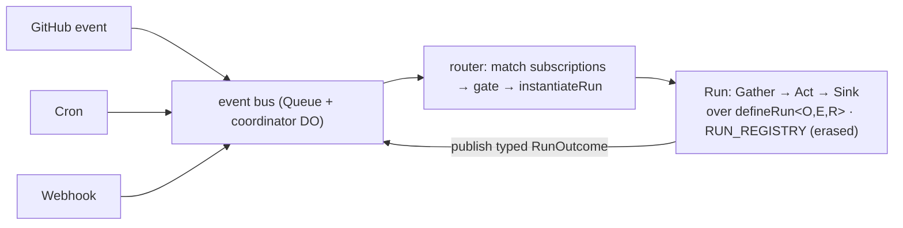

# FlareDispatch — New-Repo Build Plan

**Decision (made): incremental refactor over rewrite.** We keep the proven substrate and build the combinator tier its architecture already implies, porting into this new repo across **5 PRs**. We do *not* redesign the DSL from scratch.

> This is a greenfield build in a fresh repo, so there is no live production branch to protect — the in-place-refactor risk apparatus (regression-via-existing-tests, main-branch drift, staged safety) does not apply. What survives is a small set of design decisions the build must get right, folded into the relevant PRs below.

---

## 1. What we keep, what we add

The DSL **core** is good and load-bearing — we port it as-is in spirit:

- `capability → primitive → recipe` layering, enforced by the two entry points.
- A `Run` is a portable value bound to no runtime; `defineRun` is a passive constructor (a total function of its spec), so anything that assembles a spec and calls it produces a `Run` **indistinguishable to the dispatcher** — it registers unchanged and executes against the same Layer graph.
- The `StepRunner` Tag keeps `step()`'s durable-checkpoint mechanism swappable across CF / Dev / Test.
- Every failure is a `Schema.TaggedError` in a closed `RunError` union.

The **problem in the source** was duplication at the *authoring seam* — copy-paste-and-tweak exactly where the DSL should own a shared abstraction. In a new repo we never port that duplication; we build the abstraction once and author the real runs on it.

**One improvement we bake in because we're greenfield:** make `defineRun` **generic over `R`** (`defineRun<O, E, R>`) so each run carries its *precise* typed dependencies and a narrowed error channel, while the run **registry stores the erased upper bound** `Run<unknown, RunError, RunContext>`. This is the standard variance pattern (the same way Effects and Layers are stored erased) — a localized type design, not a rewrite. The old codebase's monomorphic `Effect<O, RunError, RunContext>` field was its one genuine typing limitation; we simply don't reproduce it.

**And we make one shape universal:** every run is `Trigger → Gate → Gather → Act → Sink`, with the trigger and the sink as the only variable poles — so a verify run and a gather-signals-then-draft-PR run (self-healing) are the same core with different poles, not two subsystems (§3).

---

## 2. The duplication the combinator tier owns

Named clusters the source copy-pasted, each of which becomes **one shared abstraction** here (so it is written once, not N times):

| Cluster | Owned by |
| --- | --- |
| command-run skeleton (checkout → loadSecrets → exec → upload-log → fail-on-nonzero) | `commandRun` builder |
| fan-out skeleton + shard schemas | `fanoutRun` builder |
| report-PR skeleton (resolveBackend → structured → openDraftPullRequest) | `reportPrRun` builder |
| detached-exec + DONE-sentinel poll | `sandbox.runToCompletion` primitive (a `Schedule` + `Effect.timeout`) |
| capability accessors (pure delegation) | `Effect.serviceFunctions(Tag)` |
| D1 retry/wrapper shells | **`@effect/sql-d1`** `SqlClient` (adopted) |
| R2 get-or-null/throw, container-tar | thin `runtime-cf/src/cf/*` helpers |
| model transport + structured-output | **`@effect/ai`** (+ `-openai` / `-anthropic`); `completeStructured` = thin wrapper over its native structured output |
| trigger idempotency key `{run}:{repo_}:{sha12}` + skip-drafts/bots | trigger helpers in `-core/recipes` |
| dispatch create + `already_exists` dedup | one `instantiateRun`, one dedup predicate |

The recipe "clones" the source carried (verbatim `*.run.ts` copies of their `runs/` twins) simply do not exist here — there is nothing to delete because we never author them.

---

## 3. Target architecture — one `run()`, two pluggable poles

Every run — verify *or* draft-PR — is the same pipeline:

```
Trigger(Source) → Gate → Gather → Act → Sink(emit)
```

Only the **Trigger** (what starts me) and the **Sink** (what I emit) differ; the middle is Effect composition — trivial for a verify run (checkout, exec), substantive for a draft-PR run (read logs/diff, `completeStructured`). `defineRun` + the dispatcher already unify *execution*; these two poles unify *authoring and causality*.



**The two poles.** A trigger is an event *subscription*; a sink is a typed *capability*. Run outcomes are themselves typed events on the same bus, so the dispatcher is a **signal router** and the feedback loop closes:

```ts
type DispatchEvent =
  | { _tag: "GitHubEvent"; kind: "pull_request" | "push" | "check_suite" | "webhook"; /* … */ }
  | { _tag: "Schedule";    cron: string }
  | { _tag: "RunOutcome";  run: RunName; verdict: Passed | Finding | InfraFault | Skipped; outcome: Json; cause: RunRef; depth: number }

type Trigger<I> = { match: (e: DispatchEvent) => Option<I> }   // subscription + decode to input
type Sink<O>    = StatusSink | PrSink | ArtifactSink            // composable — a run may use several
```

**Self-heal is a preset, not a special case** — a run whose Source is another run's failure and whose Sink is a draft PR:

```ts
export const selfHeal = (target: RunName) => reportPrRun({
  trigger: onRunOutcome({ run: target, verdict: "Finding", maxDepth: 2 }),
  gate:    confirmKOfN({ runs: 3, threshold: 2, when: "non-deterministic" }), // LLM/demo verdicts re-confirmed before escalating; deterministic oracles escalate directly
  gather:  (o)   => collect({ logs: r2.get(o.outcome.logRef), diff: gh.diff(o.cause) }),
  act:     (sig) => completeStructured(HealPlan, prompt(sig)),
  sink:    PrSink.draft,
});
```

`commandRun` = `run` with `sink = StatusSink`; `reportPrRun` = `run` with `sink = PrSink`; `selfHeal` = `reportPrRun` + `onRunOutcome`. The three builders survive as presets over one `run()`.

**Combinator hook contracts** (get these right at authoring time):

- Hooks are **effectful** and pin `E ⊆ RunError` — the core `gather`/`act` (and preset aliases like `commandRun`'s `resolveCommand`/`onResult`) all return `Effect<…, RunError, R>`. Effectful hooks are what let `offload-test` run an inline retry (distinct from the cross-run draft-PR heal above).
- The `skip` path has its own output type and is a green no-op before checkout.
- `Effect.serviceFunctions(Tag)` covers **pure-delegation** accessors only. Accessors that default/reshape opts, or that are generic over a method's type parameter (e.g. `completeStructured<A>`), stay hand-written — those are exactly the double-edit hazards, and `serviceFunctions` structurally can't host them.
- Raw `defineRun` stays the escape hatch for genuinely bespoke runs (`deploy-smoke`, `product-demo`, `pr-review`); combinators cover the ~80% case only.

---

## 4. A run authored on `commandRun`

`commandRun` lives in `@fractalboxdev/flare-dispatch-core/recipes` and **returns `defineRun(spec)`** — same portable `Run`, same Layer graph, same `StepRunner` seam. A run drops from the ~260-line hand-written skeleton to ~45 lines:

```ts
export const workerDeploy = commandRun({
  name: "worker-deploy",
  version: "1.0.0",
  limits: { maxDurationSec: 1800 },
  logName: "step.log",
  timeoutSecDefault: 900,

  // Owns the {run}:{repo_}:{sha12} key, the default-branch gate, and the
  // decoded-default restatement (install:false, secrets:[]) every trigger copies.
  trigger: checkSuiteTrigger({ defaultBranchOnly: true, failOnNonZeroExit: true }),

  // The one bespoke stage — effectful, E ⊆ RunError; skip no-ops green pre-checkout.
  resolveCommand: (input) => Effect.gen(function* () {
    const command = input.command ?? (yield* config.get(key.command(input.repo)));
    if (!command?.trim()) {
      yield* io.log("warn", `worker-deploy: ${input.repo} not opted in`);
      return commandRun.skip({ skippedReason: "not-configured" });
    }
    const secretNames = input.secrets.length ? [...input.secrets]
      : splitCsv(yield* config.get(key.secrets(input.repo)));
    return { command, secretNames, secretPrefix: input.secretPrefix ?? (yield* config.get(key.prefix(input.repo))) };
  }),

  failLabel: "deploy",
  onResult: (r) => Effect.succeed({ deployed: r.exitCode === 0 }), // effectful — self-heal rides here
});
```

The builder emits the identical checkout → `loadSecrets` → exec → upload-log → `AcceptanceFailed` body. Every builder-body failure (`AcceptanceFailed`, `StepFailed`, `SecretsMissing`, `ExecFailed`) is a `RunError` member, so `catchTag` exhaustiveness holds — provided the builder signature pins hook `E ⊆ RunError` (above). `offload-test` collapses the same way; `oxlint` drops to ~15 lines.

---

## 5. The 5 PRs

Each builder ships with a **builder-level test** (fakes + one live smoke) — the run-level fakes alone can pass while a combinator diverges against live CF, so the shared abstraction gets its own coverage.

| PR | Scope |
| --- | --- |
| **PR1 — Foundations & typed core** | Port `defineRun` as `defineRun<O,E,R>` with the erased `RUN_REGISTRY`. Stand up `@fractalboxdev/flare-dispatch-protocol` (DispatchPayload + one key/fingerprint fn). Split the two roles the source fused: the logical dedup **fingerprint** keeps `:` (and carries incident identity), but a branded **`InstanceId`** smart-constructor is the *sole* producer of every `create({id})` arg — charset `[A-Za-z0-9_-]`, ≤64, deterministic djb2 suffix — with a `previewSafeSandboxId` sibling for the DO address; CF Workflows rejects `:` in an instance id, so a raw fingerprint can never reach `create`. Route **all** dispatch create-sites through one `instantiateRun` + one dedup predicate with typed `AlreadyExists` / `InvalidInstanceId` (replaying the former, failing the latter) instead of a blanket `already_exists` swallow. `serviceFunctions` accessors for pure passthrough; hand-write the defaulting/generic ones. **Land a thin `completeStructured` in core over `@effect/ai`'s native structured output** (drops the forced-tool-call + `json-extract` + hand-rolled `classifyProviderError`) so PR3 and PR5 both consume one implementation. Add the `DispatchEvent` union (incl. `RunOutcome`) to the protocol and a publish-outcome `step()` on run completion — the dispatcher becomes the event router, and the outcome→trigger edge funnels through the same `instantiateRun`. **+audit (§8):** four-way `RunOutcome` verdict (`Passed \| Finding \| InfraFault \| Skipped`) + `RunError` partitioned into infra/finding supertypes at definition (every error carries `cause`); `FileRef` protocol type + `CaptureFailed` / `DecodeFailed` / `SizeMismatch`; inbound auth decode (HMAC verify, `installation_id`≤0→`None`, `head.sha` a decoded field) + a both-side secret-fingerprint Layer; the durable `SandboxPool` admission Tag beside `instantiateRun`; a global `HealBudget` window ceiling and incident-fingerprinted dedup. |
| **PR2 — command + fanout builders** | `commandRun`, `fanoutRun` with effectful hooks (`E ⊆ RunError` pinned, typed `skip`), trigger helpers (`checkSuiteTrigger` / `prPushTrigger` / `onRunOutcome`, all the same `Trigger<I>` shape), render helpers (`acceptanceFailure`, `draftPrBody`). Author `oxlint` / `worker-deploy` / `offload-test` and `matrix-fanout` / `vitest-shard` / `playwright-e2e` on them. **+audit (§8):** externalize the cloned workspace to a `FileRef` at end-of-checkout and re-hydrate it in exec (the container FS is not durable across the checkpoint), keeping an `isWorkingDirFailure` backstop so a lost workspace reclassifies to a retryable `InfraFault`, never a phantom lint/test finding; ship a `confirmKOfN` Gate helper for non-deterministic (LLM/demo) triggers. |
| **PR3 — reportPr + runToCompletion** | `reportPrRun` (consumes core `completeStructured`) → `ci-triage-pr` / `spec-drift-pr` / `finops-audit`. `sandbox.runToCompletion` — a `Schedule` (detach → `Effect.timeout` kill → poll-until-sentinel → bounded-read) — plus best-effort upload via `Effect.option` → `cdp-acceptance` / `product-demo`. Formalize `StatusSink` / `PrSink` as the Sink capability (so a verify run can also emit a draft PR) and author `selfHeal` as `reportPrRun` + `onRunOutcome`. **+audit (§8):** `runToCompletion` acquires its container through the `SandboxPool` Tag with a deadline from `limits.maxDurationSec`; each Sink method is typed against the GitHub permission it exercises (`PrSink.review ⇒ pull_requests:write`) bound to the single-source manifest; model retry is pinned to the *inner* call behind a shared `RateLimiter` + `Effect.all({ concurrency })` (kills the #198 replay storm); `selfHeal` gains a conditional `confirmKOfN` Gate and consults `HealBudget` before any outcome-triggered instantiate; self-heal security posture is re-homed across poles (data/instruction fencing at GATHER, credential-free proxy + egress allowlist at ACT, writeback allowlist at SINK). |
| **PR4 — runtime-cf CF adapters** | Adopt **`@effect/sql-d1`** for the D1 `SqlClient` — retires the `tryPromise` shells + `d1Retry`; failure posture is `Effect.retry` + combinators (`orDie` / propagate / `catchAll`), not a `FailurePolicy` enum. `r2` get-or-null/throw stays a thin `runtime-cf/src/cf/*` helper; pure cores and atomic SQL stay as-is. **+audit (§8):** the `container-tar` / `readFile` helpers are *retired* into one `sandbox.capture(path): Effect<FileRef, CaptureFailed \| DecodeFailed \| SizeMismatch>` chokepoint (`stat` %s/%F gate → always `readFileStream` → decode-once → multipart `putStream`), consumed by `artifact.upload` / `cache.save` / `readFile` — one place knows SDK transport encoding, and the stat-derived `SizeMismatch` is the loud backstop. Add a `step(name, Schema<A>, effect)` result codec + `buildStepConfig` (per-step timeout from `limits.maxDurationSec` onto every `step.do`, incl. raw `defineRun`); an `AccessSession` Tag (outbound CF-Access exchange, host/path-scoped, cookie-by-url) + a separate inbound viewer-gate; and the net-new image-build boundary — a `RequiredCapabilities` Schema replacing the `sandboxImage` string, one `imagePlan` (checkout closure from the pnpm dep graph), a deploy-time preflight that runtime-probes each declared capability, a PR-CI `BundleManifest` (one file, shebang, `--help` exit 0), content-digest image keying (agent SHA in), and `concurrency: cancel-in-progress` on the deploy workflow. |
| **PR5 — adopt `@effect/ai`** | Make **`@effect/ai`** (+ `@effect/ai-openai` / `@effect/ai-anthropic`) the single model stack — retires the bespoke `modelGateway` transport and the parallel `demo-agent/model.ts`. `demo-agent` and the review/heal agents share one `@effect/ai` provider `Layer` over the in-container HTTP proxy; `completeStructured` (PR1) is the thin wrapper over its native structured output. Already proven on our CF Workers, so this is `Layer` wiring, not net-new transport. **+audit (§8):** retire the raw `env.AI.run` Workers-AI binding as a transport — *all* traffic routes through the provider adapters, with response-normalization + `cf-aig-authorization` forwarding *inside* the adapter Layer; Bedrock is a dedicated SigV4 `InvokeModel` adapter over `/aws-bedrock/*` (genuine work, not a base-URL switch). |

---

## 6. Effect-TS leverage — built-ins over hand-rolled

The core is already idiomatic Effect (`Schema.TaggedError` union, `defineRun`, the `StepRunner` Tag). Rule for the port: **reach for an Effect built-in before writing a control-flow primitive, and adopt a maintained ecosystem package before hand-rolling a subsystem.**

**Built-ins (in-core, no new deps):**

| Hand-rolled | Effect built-in |
| --- | --- |
| `runToCompletion` poll dance (`maxConsecutiveExecFailures`) | `Effect.repeat` + `Schedule` (`spaced`/`exponential` ∘ `recurUntil` ∘ `upTo`); `Effect.timeout` for the kill |
| `d1Retry` / model-retry loops | `Effect.retry(Schedule…)` with `Schedule.whileInput` on a tagged error |
| `FailurePolicy` enum | `Effect.orDie` / propagate / `Effect.catchAll(fallback)` combinators |
| `uploadBestEffort` | `Effect.option` / `Effect.ignore` |
| `sharded` fan-out | `Effect.all` / `forEach(_, { concurrency })` |
| `json-extract` + ad-hoc validation | `Schema.parseJson(Schema)` / `Schema.decode` |
| `Trigger.match` / event + error dispatch | `Match` + `Match.exhaustive`; `catchTags` (never `._tag`/`switch`) |
| per-run model fan-out storm (×N concurrent × step-retry ×6) | shared `Effect.RateLimiter` + `Effect.all({ concurrency })`; retry pinned to the *inner* model call, never the durable `step()` |

**Ecosystem packages (already proven on our CF Workers):**

- **`@effect/ai`** (+ `@effect/ai-openai` / `@effect/ai-anthropic`) subsumes `modelGateway` + `completeStructured` and collapses the two-model-stack problem — its native structured output replaces the forced-tool-call emulation. → **PR5**.
- **`@effect/sql-d1`** replaces the D1 `tryPromise` shells + `d1Retry`. → **PR4**.
- **`Config` + `Redacted`** back `loadSecrets` (redaction stops secrets leaking to logs); **`@effect/platform` `HttpClient`** for model / `gh` transport.

**Kept bespoke — no Effect equivalent:** the CF-durable event bus (Queue + coordinator DO) and `instantiateRun` dedup (Effect's `PubSub`/`Queue` are in-memory; durability is CF's job — Effect `Stream`/`Match` handle only the *routing* on top); `step()` / `StepRunner` (CF Workflows is the durable engine); `defineRun` generic-over-`R` variance; the combinator tier itself; the `SandboxPool` admission semaphore + per-run `HealBudget` window (durable D1 counters — Effect's `Semaphore`/`RateLimiter` are in-memory, so the *durable* count is CF's job); and the `sandbox.capture` byte-boundary + `AccessSession` + image-build provisioner (CF SDK / Docker surface, no Effect equivalent).

---

## 7. Design decisions locked

- **One `run()`, two pluggable poles** — a `Trigger` (event subscription) and a `Sink` (typed capability); `commandRun` / `fanoutRun` / `reportPrRun` are presets, and the dispatcher is a signal router **and a capacity gate** over one event bus — every container acquisition passes through one `SandboxPool` admission boundary (D1 counting semaphore + per-key lease), capped at pool size by construction. Self-heal is `reportPrRun` + `onRunOutcome`, not a subsystem.
- **Feedback loops stay finite on three axes** — `RunOutcome.depth` bounds per-lineage (`onRunOutcome({ maxDepth })` refuses beyond N); an **incident-fingerprinted** dedup key bounds per-incident (finer than a `{sha}`-coarse key, which drops a second real incident on the same commit); and a global **`HealBudget`** window ceiling bounds the N-distinct-incident fan-out that neither depth nor dedup can — plus the skip-drafts-and-bots gate. The dedup **fingerprint** is a logical value (may carry `:` and incident identity); the CF **instance id** is its sanitized `InstanceId` derivation.
- **Generic-over-`R` `defineRun` + erased registry** — precise typed deps and narrowed error unions from day one; not a conceded limitation.
- **`serviceFunctions` for pure delegation only** — defaulting/reshaping and method-generic accessors stay hand-written.
- **Combinator hooks are effectful with `E ⊆ RunError`**; raw `defineRun` remains the escape hatch for bespoke runs.
- **Effect built-ins over hand-rolled control flow** — `Schedule` / `retry` / `timeout`, `Effect.all({ concurrency })`, `Schema.parseJson`, `Match` / `catchTags`; adopt `@effect/ai` (PR5) and `@effect/sql-d1` (PR4) over bespoke stacks (§6).
- **PR5 adopts `@effect/ai`** — one provider `Layer` over the in-container HTTP proxy (proven on our CF Workers), not a bespoke transport; nothing in PR1–PR4 depends on it (the shared `completeStructured` lands in PR1, so PR3 does not). The raw `env.AI.run` binding is retired as a transport (all traffic through the provider adapters; response-normalization + `cf-aig-authorization` inside the Layer; Bedrock via a SigV4 `InvokeModel` adapter), and model retry is pinned to the inner call behind a shared `RateLimiter` + `Effect.all({ concurrency })` — never wrapped around a durable `step()`.
- **Admission control is a dispatcher responsibility** — every container acquisition passes through one `SandboxPool` capability (durable D1 counting semaphore sized to `max_instances` + per-key lease, transient-aware retry, one deadline from `limits.maxDurationSec`); back-pressure lives in a distinct retryable channel and can never render as a test verdict.
- **Run outcome is a four-way verdict, not a bit** — `Passed | Finding | InfraFault | Skipped`, one `Match.exhaustive` → GitHub conclusion (Finding→failure, InfraFault→neutral+retry, Skipped→green no-op); `RunError` is partitioned into infra vs finding supertypes at definition and every error carries `cause`, so an infra fault is structurally incapable of surfacing as a code finding.
- **Trust-boundary crossings are decode-or-fail-loud contracts on existing stages** (no fourth pole) — Trigger decode owns inbound (HMAC, `installation_id`≤0→`None`, `head.sha` a decoded field), Sink methods are typed against the granted GitHub permission with single-source manifest parity, shared secrets are declared once with a deploy-time sync + both-side sha256[:8] fingerprints, and CF-Access is one `AccessSession` Tag (outbound, cookie-by-url) plus a separate inbound viewer-gate.
- **The container↔Worker byte boundary has one owned capability** — `sandbox.capture` is the sole chokepoint (stat-gated `readFileStream` → decode-once → `putStream`); bytes cross as a schema `FileRef` handle, reads are bounded (never materialize the whole archive), and the container FS is step-scoped non-durable state — externalize to a `FileRef` and re-hydrate in the consuming step.
- **The execution environment is a declared typed capability, gated at deploy** — runs declare a `RequiredCapabilities` set (not a `sandboxImage` string); one `imagePlan` derives build args + the checkout closure from the pnpm dep graph; a deploy-time preflight runtime-probes each capability, a PR-CI `BundleManifest` asserts the in-container binary contract, and images key on the content digest of the capability closure.

---

## 8. Architecture upgrades from the issue audit

An adversarial audit of the repo's 8 issues + 216 PRs (~90 of them bug-fix/incident) collapsed the recurring reds into eight failure *classes*, each caused by a missing owned capability rather than a one-off bug. The plan already targets two of them (model stack, self-heal); the rest are net-new seams the combinator tier must own so the class is solved once, not re-derived per run. Ranked by recurring issues retired.

| Upgrade | Fundamental cause | Arch invariant | Owned by | Issues retired |
| --- | --- | --- | --- | --- |
| **One `Model` port over `@effect/ai`** | Two parallel model stacks (Worker `modelGateway` + container `demo-agent/model.ts`) each hand-roll transport routing, structured-output emulation, and retry; provider shape-divergence leaks past transport into every decode site | One `Model` Tag over `@effect/ai` provider Layers, consumed identically by Worker + container; native `completeStructured<A>`; **retire the raw `env.AI.run` binding as a transport**; normalization + `cf-aig-authorization` inside the adapter Layer; Bedrock = a dedicated SigV4 `InvokeModel` adapter | PR5 (+PR1 `completeStructured`, PR3 governor) | 22 |
| **Auth as decode-or-fail-loud contracts** | No Principal/Credential capability — every trust-boundary crossing (HMAC, installation token, CF Access) is hand-rolled inline and fails *green* | Map each crossing onto an existing stage (no fourth pole): Trigger decode owns inbound (HMAC verify, `installation_id`≤0→`None`, `head.sha` a decoded field never ambient `GITHUB_SHA`); Sink typed against the granted permission + single-source manifest parity; a secret-parity+sync Layer (`Config`+`Redacted`+sha256[:8] both sides); one `AccessSession` Tag (outbound, cookie-by-url) + a separate inbound viewer-gate | PR1/PR2/PR3/PR4 | 20 |
| **Byte-boundary capability (`sandbox.capture`/`FileRef`)** | No capability owns "move a container path's bytes across the sandbox boundary"; each transfer re-picks an SDK read method and re-decodes framing, and the container FS is mistaken for durable state | One `sandbox.capture(path): Effect<FileRef, CaptureFailed \| DecodeFailed \| SizeMismatch>` chokepoint (`stat` size gate → always `readFileStream` → decode-once → `putStream`); `FileRef` schema handle rides checkpoints, never inline bytes; reads are *bounded* (never `.arrayBuffer()` the whole archive); container FS is step-scoped non-durable — externalize to a `FileRef` and re-hydrate in the consuming step (keep #206's `isWorkingDirFailure` backstop) | PR4 (+PR1 `FileRef`, PR2 workspace) | 15 |
| **Four-way `RunOutcome` verdict + `RunError` partition** | The run→dispatcher boundary reduces a rich result to a pass/fail bit, so infra faults render as code findings and causes get swallowed | `verdict = Passed \| Finding(summaryMd) \| InfraFault(cause) \| Skipped(reason)`, one `Match.exhaustive` → GitHub conclusion; partition `RunError` into infra vs finding supertypes at definition; every `TaggedError` carries `cause` (`Cause.pretty`); a branded absolute `ArtifactRef` is the Sink's only link type | PR1 | 15 |
| **Execution env as a declared typed capability** | The sandbox env is an imperative property of one hand-maintained Dockerfile + a coarse `sandboxImage` string; every drift surfaces only at `Deploy` on main | Replace the enum with a Schema `RequiredCapabilities` set the run declares; one `imagePlan` → build args + checkout closure (computed from the pnpm dep graph, #159 gone); a deploy-time preflight that **runtime-probes** each declared capability; a PR-CI `BundleManifest` assertion (one file, shebang, `--help` exit 0); content-digest image keying; DO migrations = a reviewed delta vs a persisted tier ledger; `concurrency: cancel-in-progress` (not `Effect.timeout`) fixes the #77 build-queue hang | PR4 (net-new) | 14 |
| **`SandboxPool` admission capability** | The container pool is a finite shared resource nothing models; capacity is scattered across global/per-container/per-acquisition altitudes | One `SandboxPool` Tag is the sole scoped path to a container: D1 counting semaphore (sized to `max_instances`) wrapping the per-key lease, bounded transient-aware retry, one wall-clock deadline from `limits.maxDurationSec`; the dispatcher is a capacity gate, not only a router | PR1 Tag, PR3 consumes | 11 |
| **Branded `InstanceId` + typed step seam** | The `step()`/`create({id})` boundary is an untyped passthrough; four platform contracts are re-encoded per authoring site | Branded `InstanceId` is the sole producer of a create id (dedup fingerprint stays logical, keeps `:`); `step(name, Schema<A>, effect)` encodes-before-checkpoint so an `Option`/live-handle can't cross; typed `AlreadyExists`/`InvalidInstanceId`; `buildStepConfig` maps a per-step timeout onto every `step.do` incl. raw-`defineRun` runs | PR1 (id/errors) + PR4 (codec/config) | 11 |
| **Self-heal finiteness — 3 axes + confirm** | No cross-incident budget and no first-class outcome→run edge, so finiteness was emergent from scattered guards | Keep the preset (already planned); add a global `HealBudget` window ceiling (distinct from the per-execution `AgentBudget` DO), a conditional k-of-n confirm Gate for non-deterministic verdicts, incident-scoped dedup, and re-home security posture across poles (data/instruction fencing at GATHER, credential-free proxy + egress allowlist at ACT, writeback allowlist at SINK) | PR1/PR3 | 11 |

**Net-new scope (not implied by §1–§7): image-build/provisioning, `SandboxPool`, and the auth boundary.** All three were absent from the plan — it treated the sandbox as an already-provisioned, already-admitted, already-authenticated surface it merely consumes. Fold them in explicitly or a merge burst / cold deploy re-introduces #109, #75, and the CF-Access saga (#101→#204) verbatim. For image-build, prioritize the three low-cost structural wins (computed checkout closure #159, PR-CI `BundleManifest` #195/#196, content-digest keying #207); a full `SandboxProvisioner` with mechanical DO derivation over-reaches — migrations are an append-only stateful ledger, not a free derivation.

**Corrective refinements to seams the plan already sketches.** The byte-boundary upgrade is *consolidation*, not reinvention: the source already fixed decode across #89/#98/#108/#100/#70 — the defect is that those live at 2+ call sites with no owned chokepoint, so the next "thin helper" tweak re-breaks a consumer. The four-way verdict is a strictly-better version of §3's binary `status` sketch and lands wholly in PR1. The `InstanceId` split refines PR1's fingerprint fn (see §5 PR1 and §7) — the fingerprint keeps `:`, only the derived id is sanitized.

**Already implied, now tightened.** The `@effect/ai` collapse (PR5) and self-heal preset (§3) are on-plan; the audit only adds the residual gaps that let cited members recur — retire the `env.AI.run` binding path, pin model retry to the *inner* call (never the durable `step()`) behind a shared `RateLimiter` + `Effect.all({ concurrency })` to kill #198's ×6 replay storm, and add the global `HealBudget` the depth+dedup guards structurally cannot provide. Two out-of-scope notes: #106 (container SSE `atob()`) belongs to the byte class, not model transport; #167/#171 (log-viewer exec-stream rendering) are a different data source than the verdict and are not fixed by `render(RunOutcome)`.
