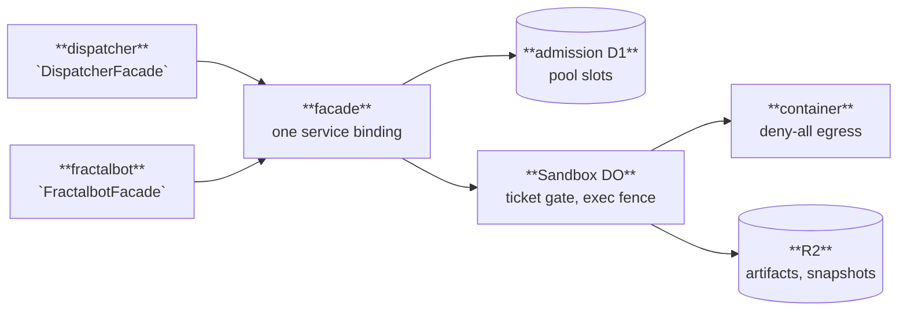

# The flare-dispatch substrate

The substrate is where agentic work runs: containers under deny-all egress, ticket-gated admission
that owns the account's Containers ceiling, artifacts on R2, and metered model access. It executes;
it never decides what to run and never renders an outcome. Consumers — the dispatcher in this repo,
fractalbot from its own — reach it through one service-binding facade and nothing else.

These four documents are what a consumer or an operator needs; none of them requires reading the
substrate's source.

| Document | For | Answers |
| --- | --- | --- |
| [Consuming the facade](facade.md) | Consumer authors | How to bind, what the call sequence is, how every failure arrives |
| [Facade API reference](../reference/substrate-contract/README.md) | Consumer authors | Every exported type, generated from `packages/substrate-contract` |
| [Authoring a grant profile](grant-profiles.md) | Substrate and consumer maintainers | How egress is granted, how a profile is written and reviewed, how it graduates to enforcement |
| [BYOC upgrade runbook](byoc-upgrade.md) | Operators | Provisioning, the overlay, deploy order, version floors, rollback |
| [Contract versioning policy](contract-versioning.md) | Both | What bumps `CONTRACT_VERSION`, and what a consumer migration costs |

Design records live under [`apps/substrate/specs`](../../substrate/specs/README.md): the platform
spec states *what*, the ADRs carry *why*. These guides state *how*, and cite the ADR wherever a
decision is load-bearing.
