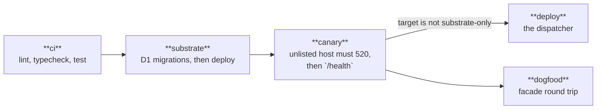
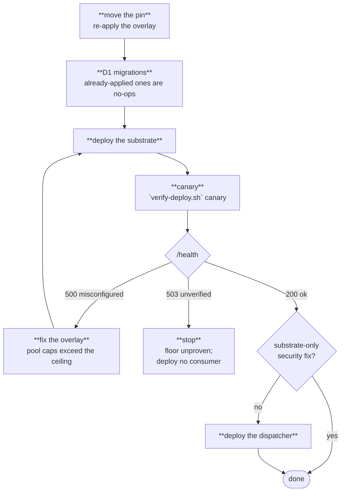

# BYOC upgrade runbook

Every organization deploys its own substrate into its own Cloudflare account — no multi-tenant SaaS,
no shared fleet. An org runs two workers from one upstream pin: `flare-dispatch-substrate`
(`apps/substrate/wrangler.jsonc`) and the dispatcher (`wrangler.jsonc` at the repo root). fractalbot,
if the org runs it, deploys from its own repository and binds to the substrate by name.

This runbook covers provisioning, the overlay an org maintains, deploy order, and what changes when
a release is a security release rather than a product one.

## Provision, once per account

```sh
wrangler d1 create flare-dispatch-substrate
wrangler d1 migrations apply flare-dispatch-substrate --remote
wrangler r2 bucket create flare-dispatch-substrate
wrangler secret put TICKET_SECRET          # -c apps/substrate/wrangler.jsonc
```

`TICKET_SECRET` keys the admission tickets a container class demands before it will boot
([ADR-0004](../../substrate/specs/adr/0004-admission-enforced-by-ticket.md)). It is minted and
verified entirely inside the substrate worker and is never shared with a consumer; generate it from a
CSPRNG, not a passphrase. Rotating it invalidates live tickets, so executions admitted in the
preceding 10 minutes fail closed and re-admit — do it during a quiet window or accept that cost.

The admission D1 is bound to this worker and no other. That exclusivity is the structural half of
"one admission path": a second worker holding the same database by id could write the table, and any
worker holding a container binding could boot a container around the gate.

## The overlay

The committed `apps/substrate/wrangler.jsonc` carries the origin org's resource ids inline, on
purpose — an id that lives only in someone's shell is an id the next deploy cannot reproduce.
A second org maintains its own copy and changes exactly these:

| Field | Why it changes |
| --- | --- |
| `d1_databases[0].database_id` | The id `wrangler d1 create` printed in your account |
| `r2_buckets[0].bucket_name` | Only if the name is already taken in your account; bucket names are per-account |
| `vars.CONTAINERS_CEILING` | Your account's Containers headroom, minus anything else in the account using it |
| `containers[].instance_type` / `max_instances` | Your fleet sizing |
| `vars.SANDBOX_SLEEP_AFTER` | Idle window before a finished container sleeps; default `10m` |

Two settings interact in a way that bites. `keep_vars: true` means a deploy does not delete vars it
does not declare — so `POOL_CAPS`, which the committed config never declares, can be set out of band
(dashboard or `wrangler`) and survives every deploy. `CONTAINERS_CEILING` *is* declared, so an
out-of-band change to it is overwritten by the next deploy. Change the ceiling in the overlay; the
pool partition may live outside it.

The partition must fit the ceiling: the per-pool caps (`lean` 6, `browser` 3, `agent` 3, `task` 4 by
default) sum to at most `CONTAINERS_CEILING`, or admitted work exceeds the containers that can serve
it and the platform starts refusing creates that no gate refused. **The assertion runs on `/health`,
not at deploy** — a bad partition deploys successfully and then reports
`{"status":"misconfigured"}` with a 500. Checking health after deploy is therefore not optional; see
below.

Whatever else you change, do not touch `"name": "flare-dispatch-substrate"`. It is frozen at the
first BYOC deploy because consumers' service bindings resolve against it by name, including
fractalbot's from another repository.

## Deploy, in order

The substrate deploys **before** any consumer. A service binding resolves against a Worker that must
already exist, so a dispatcher deployed first has a binding to nothing.

```sh
pnpm exec wrangler deploy -c apps/substrate/wrangler.jsonc   # substrate first
pnpm exec wrangler deploy                                    # then the dispatcher
```

In CI the ordering is a job dependency rather than a step order — `.github/workflows/deploy.yml` runs
`ci` → `substrate` → `canary` → `deploy`, with `needs:` between them. That is deliberate: a step
ordering inside one job is lost the moment someone adds a matrix or reorders for speed, and a substrate deploy that
fails must stop the dispatcher's. Half a topology is worse than none of it.



Container images are rebuilt by `wrangler deploy` on the runner, which is why the deploy job needs
Docker.

**Substrate-only deploys are the point of the split.** The first command above stands alone, so a
security patch never queues behind a product release, and an org that wants the execution environment
without the CI product deploys only that worker
([ADR-0002](../../substrate/specs/adr/0002-substrate-inside-the-flare-dispatch-monorepo.md)).

## Verify

```sh
apps/substrate/scripts/verify-deploy.sh https://<your-substrate-host> canary
apps/substrate/scripts/verify-deploy.sh https://<your-substrate-host> health
# /health → {"status":"ok","version":"0.1.0","contractVersion":1,"deployment":"…",
#            "pools":{"lean":6,"browser":3,"agent":3,"task":4},"ceiling":16,
#            "canary":{"status":"passed","evidence":"…","checkedAt":…,"substrateVersion":"0.1.0"}}
```

The canary is the check
[ADR-0011](../../substrate/specs/adr/0011-sdk-pin-as-security-surface.md) specifies: `POST /canary`
boots a container and asserts that an HTTPS fetch to an unlisted host dies with a 520. It needs no
credential, and a verdict is stored per deployment, so repeat calls reuse it rather than boot another
container — a `passed` or `failed` verdict stands for 24 hours, an `inconclusive` one for 10 minutes.

`/health` answers `200 ok` only while a fresh, passing canary exists for the running deployment;
otherwise it answers `503` with `"status":"unverified"` and the canary block says why (`never-run`,
`failed`, `inconclusive`, or a verdict past its window). A `500` with `"status":"misconfigured"` means the pool
partition does not fit the ceiling and names which; fix the overlay and redeploy. `version` is the
substrate release an operator is running — the number a security advisory declares a floor against.
`contractVersion` is the facade generation this deployment serves, which is what tells a consumer
maintainer whether their pin still matches ([versioning policy](contract-versioning.md)).

One caveat on what health does *not* prove: `SUBSTRATE_VERSION` is a hand-maintained constant kept in
step with `apps/substrate/package.json` by review, so it reports the version someone last wrote, not
the code that is running — a version-floor check is only as good as that discipline. The canary
verdict is keyed to the Worker's version id, so it speaks for the build that is running — provided the
overlay keeps the `version_metadata` binding; without it the key falls back to that same semver.

## Upgrading

A routine upgrade is: move your pin to the new upstream commit, re-apply your overlay, run the two
deploys in order, check health. Migrations under `apps/substrate/migrations` are applied by
`wrangler d1 migrations apply` and are not run by a deploy — a release that adds one says so.



A **security release** carries three things a routine one does not: the minimum supported version, a
statement of what the floor loses below it, and whether the fix is substrate-only. Compare the
declared minimum against `/health`'s `version`, and if the fix is substrate-only take only the first
deploy command — do not bundle it with a dispatcher release you were not ready to ship.

**The advisory channel is not designated.** The platform spec requires that security releases declare
a minimum supported version on an advisory channel; nothing in this repository names one, so an
operator today has no push notification and must watch releases to learn a floor moved. Naming the
channel is outstanding work; whatever it turns out to be has to carry those three fields, because a
floor an operator cannot discover is a floor only the origin org is standing on.

Never bump `@cloudflare/sandbox` or `@cloudflare/containers` as a routine dependency update. The
deny-all posture depends on verified internals of both — an empty allowlist engages interception
because of how the effective-allowlist state is computed — and a bump that changes those semantics
fails toward **open egress**, silently. Every bump is a security-reviewed change with the invariant
checklist re-run (ADR-0011). Taking an upstream pin inherits the reconciled pair; bumping them
locally means owning that re-verification.

## Rolling back

Redeploying the substrate churns every running container: the worker's Durable Object classes are
replaced, executions in flight lose their container, and consumers see the next `ensureSandbox`
return `rebuilt: true` with a bumped `generation`. Work that was not checkpointed is gone. That blast
radius is the structural reason the substrate is its own worker — so dispatcher and fractalbot
releases never pay it — and it applies to a rollback exactly as it applies to a deploy.

So: prefer rolling forward. When a rollback is genuinely the right call, drain first if you can
afford to (stop admitting, let executions checkpoint), then `wrangler rollback` or redeploy the
previous pin, then check `/health` again. A rollback that crosses a contract change has a second
constraint — consumers pinned to the newer contract may no longer be served — which is why breaking
contract changes ship as expand-then-migrate rather than as a swap.
