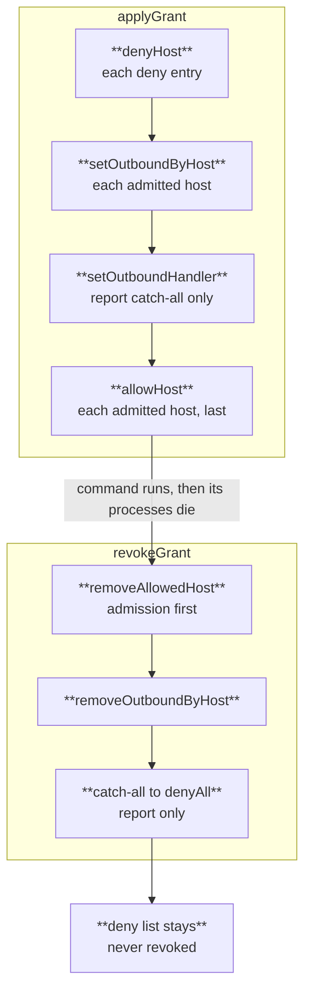
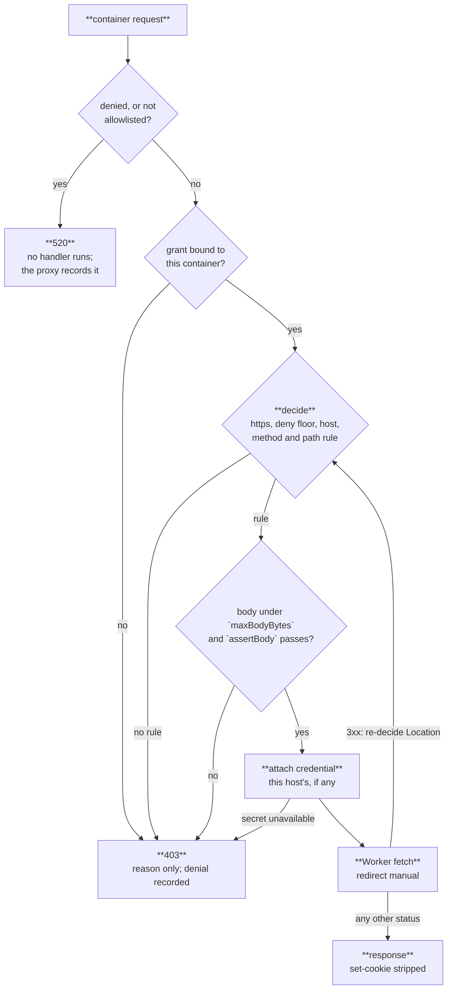

# Authoring a grant profile

Containers run with `enableInternet = false` and an empty allowlist, so nothing leaves them until a
grant is issued. A **grant profile** is a named, security-reviewed egress policy the substrate holds
in code; a recipe may select among profiles through `SubstrateRecipe.profiles`, and can never define
one ([ADR-0005](../../substrate/specs/adr/0005-deny-all-egress-with-grant-profiles.md)).

The reason for that asymmetry is the threat model. The workload is assumed hostile — a `postinstall`,
a `build.rs`, a `conftest.py` — so nothing may depend on a model or a payload cooperating. A grant
derived from a dispatch input is a grant an attacker steers, which defeats deny-all outright.

Six names are reserved and served: `public-repo-read`, `js-install`, `rust-install`,
`browser-fetch`, `cf-api`, `github-api-read`, each an entry in `GRANT_PROFILES`
(`apps/substrate/src/engine/profiles.ts`). `recipeProblem` in `apps/substrate/src/facade.ts` checks
every selection against that catalog and rejects a name it does not carry — or any profile on a
recipe with no `repo` — with a `recipe-rejected` refusal, so a consumer gets a typed answer rather
than silent open egress. Selected profiles compose onto `public-repo-read`; they never replace it.

## What a profile is made of

A profile is a function from grant params to an `EgressPolicy`, living beside `publicRepoPolicy` in
`apps/substrate/src/engine/profiles.ts`:

```ts
type EgressPolicy = {
  repo: string;                             // the non-model-authored input rules assert against
  hosts: { host: string; rules: PathRule[] }[];
  deny: readonly string[];                  // the floor, matched by glob
};

type PathRule = {
  method: "GET" | "POST";
  match: (url: URL) => boolean;
  maxBodyBytes?: number;
  assertBody?: (raw: string) => string | undefined;  // a denial reason, or undefined
};
```

`buildGrant` turns a policy into the four calls that arm a container — `denyHost`,
`setOutboundByHost`, `setOutboundHandler` (the `report` catch-all only), `allowHost` — and
`applyGrant` issues them in that order. Admission is last on
purpose: `allowedHosts` is evaluated strictly before any handler, so admitting a host before its
handler is mapped opens a window where requests fall through to public egress.



## Three properties every profile must hold

Every outbound request from a container under an `enforce` grant takes this path:



**Host scope proves nothing.** Within a grant window the workload picks the request, and the same host
serves opposite operations: `github.com` carries `git-upload-pack` (read) and `git-receive-pack`
(push), and the LFS batch endpoint serves download and upload at one URL with one method. Assert the
method, assert the path, and where a single (method, path) serves both directions assert the **body**
— that is why the LFS rule parses the JSON and requires `operation: "download"`, capped at 256 KiB.
Everything a rule asserts against must be a value no model authored; today that is `params.repo`,
frozen consumer-side.

**A handler's own fetch is a Worker fetch.** None of `enableInternet`, `allowedHosts` or `deniedHosts`
govern it, so following a redirect is a bidirectional channel straight through the allowlist. Every
request the engine makes is `redirect: "manual"` and every `Location` is re-decided against the full
policy, not just the host — a redirect landing on an admitted host at a path outside the grant is the
same escape. If your profile's host 302s to a CDN, that CDN needs its own host entry with its own
rules, or the fetch fails. That failure is correct: it is the policy noticing a host it cannot inspect.

**Admission is not inspection.** Precedence ends in public egress, so an allowlisted host with no
mapped handler gets a direct, unseen fetch. `buildGrant` therefore emits concrete hostnames only and
throws when the admitted set differs from the handled set. A glob belongs in the deny list and
nowhere else: deny entries are matched with `hostMatches`, so a pattern there can only ever refuse
more — which is why `WRITE_SINKS` (`gist.github.com`, `uploads.github.com`, `api.github.com`) would
still hold if the admitted set were later widened to a whole subdomain.

One consequence is easy to get wrong: **denies are never revoked.** `revokeGrant` drops admissions and
handlers and deliberately leaves the deny list in place — nothing about an execution finishing should
make a write sink reachable again, and `removeDeniedHost` filters `effectiveDeniedHosts`
(`@cloudflare/containers@0.3.7`), which would silently weaken a class-level deny list the moment one
is added.

## Writing one

1. **Start from evidence, not from the tool's documentation.** Run the workload and collect the hosts
   and paths it actually reaches. Read [Watching what a workload needs](#watching-what-a-workload-needs)
   first — the observation path has a sharp limitation.
2. **Write `<name>Policy(params: GrantParams): EgressPolicy`** next to `publicRepoPolicy`. Keep the
   host list concrete and the rule list narrow; a profile that admits a package registry's whole
   domain to serve one download path is a profile that ships an exfiltration channel.
3. **Cap and assert every POST.** `maxBodyBytes` is mandatory on a POST rule — the handler checks the
   declared `content-length` and then the buffered body against the matched rule's cap, defaulting to
   zero, so a POST rule without a cap denies everything. Add `assertBody` wherever the body is what
   distinguishes read from write.
4. **Name the weaknesses in the profile's own comment.** `objects.githubusercontent.com` carries opaque
   signed paths with no repository segment, so the only controls left there are GET-only and no body —
   which is why LFS is opt-in behind `recipe.lfs` rather than part of the default clone grant. A host
   whose paths cannot be scoped to a non-model-authored input should be opt-in for the same reason.
5. **Route it.** Add the profile to `GRANT_PROFILES` in `engine/profiles.ts`. That catalog is both
   what `grantPolicy` composes a grant from and what the `recipeProblem` gate checks selections
   against.
6. **Add the name to `GrantProfileName`** in `packages/substrate-contract/src/index.ts`. That is an
   additive widening of an input union: non-breaking, no `CONTRACT_VERSION` bump
   ([versioning policy](contract-versioning.md)).
7. **Test the policy, not the plumbing.** `egress.test.ts` is the pattern: the admitted/denied table,
   one redirect that must be re-policed, one same-URL read/write pair separated only by the body, and
   `buildGrant` refusing a policy whose admitted set exceeds its handled set.

## Review checklist

A reviewer is approving an egress channel, so the questions are about what the profile makes
reachable, not about style:

- Every admitted host is a concrete name, and every admitted host has a handler.
- Every rule asserts method **and** path. Any (method, path) that serves both read and write asserts
  the body too.
- Every value a rule asserts against traces back to an input no model authored.
- Every POST rule carries a `maxBodyBytes` sized to the real request, not a round number.
- Redirect targets of the admitted hosts are either inside the policy or genuinely absent.
- The deny floor is extended or left alone, never shrunk.
- Credentials: if the profile needs one, it is injected in the handler from a per-host descriptor and
  the container is handed nothing
  ([ADR-0006](../../substrate/specs/adr/0006-credential-boundary.md)). A profile that works only
  because a secret sits in the container's environment is not ready.
- The profile's comment states what it cannot control, in the terms the LFS host's comment does.

## Watching what a workload needs

Every denial is recorded per execution as `{host, method, path, reason, count}`, aggregated into the
`sub_denials` table keyed by container id, and never surfaced into the container beyond a reason-only
403 — a hostile process must not be able to use denial text as an oracle for what else it could have
reached.

Denials come from two places. A handler 403 — admitted host, wrong method, path or body — is recorded
by the handler itself. A host that is not admitted at all dies as a bodyless platform 520 *before any
handler runs*; the substrate's outbound proxy (`apps/substrate/src/outbound-proxy.ts`) sits in front
of that gate and records it as `host … is not admitted (refused by the container gate)`, leaving the
response byte-for-byte unchanged. So iterating against denial events shows both the paths you got
wrong on hosts you listed and the hosts you never listed.

**One failure still leaves no row.** A container that fails to trust the interception CA fails TLS on
every HTTPS request, which produces no 520 to classify. The deploy-time canary's HTTPS probe detects
exactly that, and `/health` answers `503 unverified` until it passes.

A consumer reads an execution's denials through the facade: `denials(key)` returns the aggregated
`DenialEvent[]` for that key, and an unreadable trail comes back empty, logged in the substrate.

## Graduating a run: `legacy` → `report` → `enforce`

`SubstrateRecipe.enforcement` is ADR-0005's three-position per-run flag, so a workload can move onto
deny-all without a flag-day. Absent means `enforce`, and only reviewed consumer code sets it:

| Position | Egress posture | What it is for |
| --- | --- | --- |
| `legacy` | The workload's pre-substrate posture; nothing is denied | Runs that have not been looked at yet |
| `report` | Legacy posture still flows, and every request the profile *would* have refused is recorded | The authoring loop — write the profile, watch a window, read what you missed |
| `enforce` | The profile is the policy; anything outside it is refused | The end state, and the floor for every workload |

A run graduates from `report` to `enforce` after a clean window: no would-be denials attributable to
legitimate work across the run's normal traffic, including its slow paths — a weekly cron and a
dependency-refresh path both reach hosts a single PR run never touches. The reviewer who merges the
profile is the one who flips it, in the same PR as the profile or the one after.

Under `legacy` and `report` the grant admits every host. `report` also maps a catch-all handler that
runs `decide` against the selected profiles, records each refusal it *would* have made with a
`would-deny: ` prefix, and forwards the request untouched. It injects no credential: an unenforced
grant is never the path on which a secret first reaches a host
([ADR-0006](../../substrate/specs/adr/0006-credential-boundary.md)). Every position validates the
profile selection, so a run cannot discover on graduation day that its profile set is unservable.

## May BYOC operators author custom profiles?

ADR-0005 left this open. **Yes — as code in the operator's own overlay, compiled into their substrate
deploy, and never as runtime configuration.** This is the documented answer, with its reasoning below;
it is not yet ratified into ADR-0005, which still records the question as open.

**The question is not a permission.** An operator holds the Cloudflare account, the checkout and
`TICKET_SECRET`. Anyone who can deploy the substrate can already edit `egress.ts`, and upstream has no
mechanism to prevent it and should not pretend otherwise. What upstream actually decides is which path
is supported — a fork, or an extension point — and what the change has to pass through.

**What is at stake is the gate, not the author.** ADR-0005's property is that a grant derives from
reviewed code. Config-shaped profiles — a KV value, a var, a JSON blob in the dashboard — move the
gate from "merge rights on a repository" to "holds a Cloudflare API token with Workers:Edit". In most
orgs that is a larger set of people, and the change carries no diff, no review, no git history, and no
redeploy — so the ADR-0011 canary never re-runs against the changed posture and nobody can answer
"what was the egress policy last Tuesday". That is a downgrade of the one property the whole ADR rests
on, and it is why the answer is code rather than configuration. The review gate is the operator's own
code review plus their deploy pipeline — the same gate that already protects their `wrangler.jsonc`,
their pool caps and their ticket secret. Upstream does not review operator profiles and does not claim
to.

**Upstream's obligation is to make the invariants executable rather than advisory.** An operator
should not have to re-derive the three properties above from prose. `buildGrant` already throws on a
malformed repo slug and on an admitted host with no handler; the remaining checks — no glob in the
admitted set, every rule asserting method and path, every POST rule capped, the deny floor extended
and never shrunk — belong in a validator the substrate exports so an operator's own tests call it.
Shipping that validator is what turns this answer into something an operator can rely on, and it is
the work this position implies.

**Reserved names, prefixed extensions.** The six upstream names must mean the same thing in every
deployment; that is what makes a support conversation about `js-install` possible at all. Operator
profiles take an `x-` prefix. `GrantProfileName` is a closed union today, so a custom name does not
type-check — the widening is ``| (`x-${string}` & {})``, an additive change to an input union that
does not bump `CONTRACT_VERSION`.

Ratifying this means three things: amending ADR-0005, exporting the validator, and widening
`GrantProfileName`. None of them is done.
