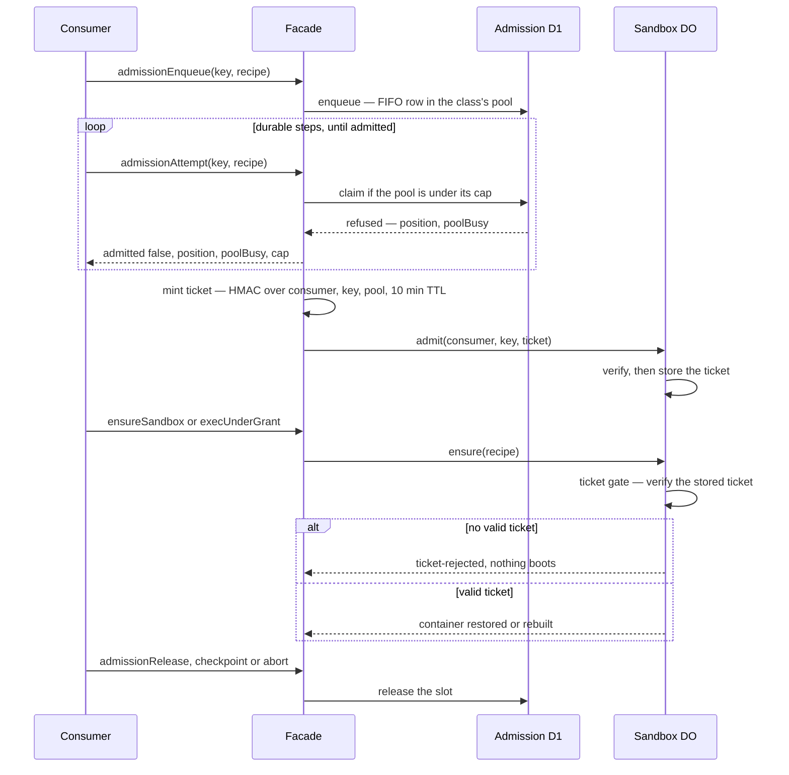

# ADR-0004: Admission is enforced by ticket, and the substrate alone owns the ceiling

- **Status:** Proposed
- **Date:** 2026-08-06
- **Implementation:** `shipped` — `src/admission/ticket.ts:71` mint / `:87` verify, gated at `src/sandbox-do.ts:204,221`, minted at `src/facade.ts:126`. Tests: `admission/ticket.test.ts`, `admission/pools.test.ts`, `sandbox-do.workers.test.ts`.

## Context

Both consumers draw on one account-level Containers ceiling with no view of each other. flare-dispatch
built a strongly-consistent D1 FIFO counting semaphore with heartbeat decay
(`packages/core/src/run-admission.ts`, `container-lease.ts`); fractalbot built an advisory check that
reads a best-effort projection, fails open on outage, and leans on wrangler `max_instances`
(`src/sandbox-policy.ts`, `src/agent.ts` — "admission counts unavailable — admitting"). On a busy CI
day one fleet consumes the headroom and the other's creates fail at the platform with no gate having
refused anything. "One admission path" as a convention would not survive: any worker holding a D1
binding by database_id could still write the table, and any binding-holder could still boot a
container. Consumers also need opposite wait semantics — a Slack task must refuse fast with an
actionable reason; a CI run must queue with visible progress, hibernating in its own durable steps.

## Decision

- The substrate mints an **admission ticket** (HMAC over consumer, key, pool and expiry; 10-minute
  TTL, re-minted on heartbeat and never extended in place) on admit; a container class refuses to
  boot without a valid ticket. Enforcement is at the container, not in the caller.
- One pool per image class — lean, browser, agent, task — each with its own cap; deploy-time
  validation asserts the cap-sum stays within the account Containers ceiling. That cap partition,
  not FIFO fairness, is what prevents CI starving interactive tasks.
- Consumers drive queue waits via `admission.enqueue/attempt/release`, hibernating in their own
  durable machinery; `ensure()` never blocks on a queue. Admission mode is consumer-chosen:
  `{mode:'refuse'}` or `{mode:'queue', maxQueueAgeMs}`. Refusal/timeout is a typed error carrying
  `{pool, poolBusy, cap, position?, queuedForMs?, retryAfterMs?, timedOut?}`. A queued execution
  that has waited `maxQueueAgeMs` or longer is refused with `timedOut: true` and loses its queue
  row; `poolStatus()` exposes per-pool, per-consumer occupancy.
- The admission D1 is bound to the substrate worker only. Consumer-side quotas (fractalbot's
  per-conversation/per-user caps) stay consumer-side, ahead of the physical gate.

A queued consumer polls from its own durable steps; the container boots only against a ticket the
DO verifies itself.

## Consequences

- "Zero out-of-gate container creates" becomes testable: call `ensure()` without a ticket and watch
  it fail closed; structurally, no `containers` stanza exists outside the substrate's wrangler config.
- fractalbot gains real admission for the first time; its fail-open behavior is deliberately not
  ported into the shared gate.
