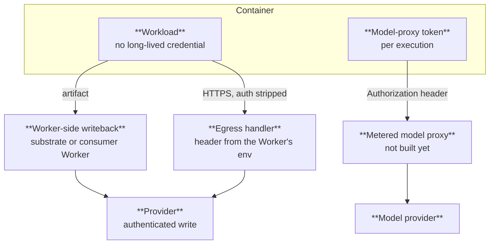
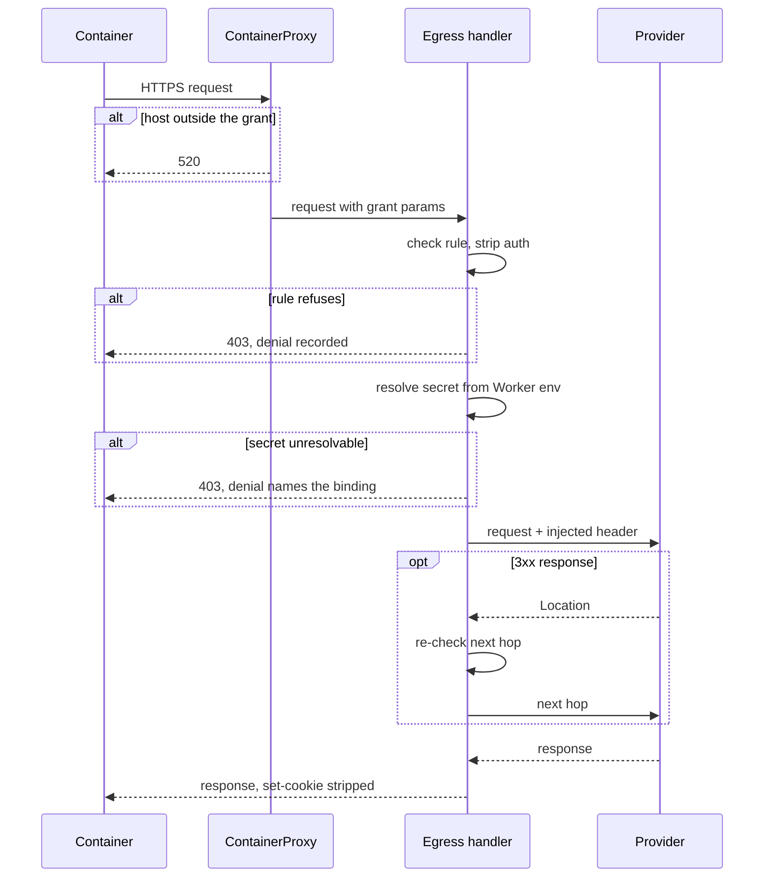
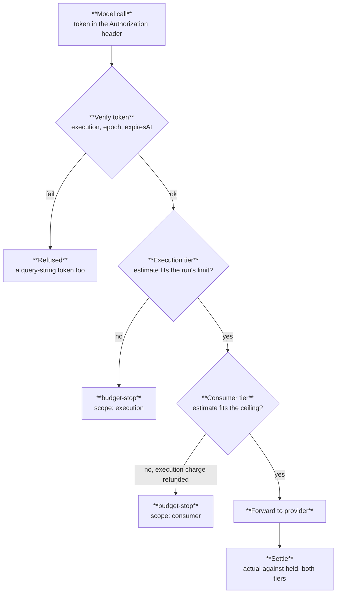

# Credential boundary — migration status

[ADR-0006](adr/0006-credential-boundary.md) states the rule: no long-lived credential is reachable
from inside a container — env, argv, or filesystem. The rule takes effect **per credential class as
its shape lands**, so this page is the ledger of which classes are done and what each remaining one
is waiting on. [ADR-0009](adr/0009-two-tier-budgets.md) carries the one sanctioned exception.

## The two sanctioned write shapes

**Worker-side writeback (preferred).** The container produces an artifact; the substrate or the
consumer's Worker performs the authenticated write. The credential never exists on the container
side of the boundary, so there is nothing to leak, scrub, or expire.

**Handler-injected credentials.** For writes with no artifact to hand back — `wrangler deploy`
authenticates its own HTTPS calls mid-build — the credential is a per-host descriptor
`{secretName, host, headerTemplate}` frozen in
[`src/engine/credentials.ts`](../src/engine/credentials.ts) and selected by grant-profile name. The
egress handler resolves the value from the substrate Worker's own environment and sets the header on
requests that pass the grant; the container gets nothing.

Four controls make the second shape safe, one function each:

| Control | Where |
| --- | --- |
| The container never names the secret — descriptors are catalog entries keyed by reviewed profile name | `CREDENTIAL_CATALOG` |
| A descriptor cannot reach an arbitrary binding — `TICKET_SECRET` and `MODEL_PROXY_SECRET` are unreachable | `INJECTABLE_SECRETS`, `src/secrets.ts` |
| A template or a secret value cannot forge a second header — CR/LF and control characters refused | `parseHeaderTemplate`, `renderCredential` |
| A container's own auth headers never survive — the forwarded-header allowlist is asserted at module load | `CONTAINER_AUTHORED_AUTH_HEADERS`, `egress.ts` |

Unresolvable descriptors fail **closed**: the request is refused and recorded as a denial naming the
missing binding, rather than sent unauthenticated to fail confusingly at the provider.

One enforced request through a credentialed profile:

## Migration table

| Credential class | Shape | Status |
| --- | --- | --- |
| GitHub installation token | Scrub | **Done.** Remotes are rewritten to their credential-free form immediately post-clone, and `.git/config`, `.git-credentials` and `.netrc` are redacted at the artifact/checkpoint capture chokepoint. A redaction that does not complete skips the backup — no capture is better than a captured token. `src/engine/git-scrub.ts`. |
| `CLOUDFLARE_API_TOKEN` | Handler injection | **Machinery done, adoption pending.** The `cf-api` profile admits `api.cloudflare.com` scoped to one account's `/workers/` surface and attaches the token in the handler. `worker-deploy` moves off its `secrets` input when the dispatcher adopts the facade. |
| npm token | Handler injection | **Machinery done, adoption pending.** The `js-install` profile carries an `NPM_TOKEN` descriptor for `registry.npmjs.org`, read-only. `npm publish` is a write with an artifact to hand back and stays on writeback. |
| Operator secrets (Clerk keys, staging URLs, CF Access pairs) | Writeback, or descriptors | **Open.** Each is a per-run decision made as its run migrates; nothing here is generic. |
| Model access | Metered proxy token | **Enforcement floor done, proxy pending** — see below. |

`secrets` / `secretPrefix` are deprecated on every run input that takes them (`check`,
`offload-test`, `cdp-acceptance`, `playwright-demo`, `worker-deploy`) and on the `loadSecrets`
primitive. They are removed at stage-2 exit, not before: a run cannot lose its credential path until
its replacement shape is wired.

## The one in-container credential

The per-execution model-proxy token is the sanctioned exception — an agent that cannot reach a model
cannot do agentic work, and there is no artifact to hand back mid-inference. It is narrow by
construction (`src/budget/token.ts`):

- **Execution-scoped** — the claims name the execution and the consumer, so a lifted token
  authenticates as that execution and buys at most its remaining budget.
- **Budget-capped** — the token authenticates and carries no balance. Spend lives in the two-tier
  store, the only thing that can refuse.
- **Header-only** — a `?token=` is refused even when it would verify. Query parameters land in
  access logs and shell history.
- **Revoked at max wall-clock** — `expiresAt` is clamped at mint and checked every call, so expiry
  does not depend on finalize running or an alarm firing. ADR-0006 describes revocation by DO alarm;
  a clamped signed expiry is the same property without a timer to miss, and the `epoch` claim is the
  early-revoke path the store bumps.

[ADR-0009](adr/0009-two-tier-budgets.md)'s two tiers are enforced in
[`src/budget/`](../src/budget/): per-execution metering against the run's declared limit, and a
per-consumer ceiling that holds when a consumer's own ledger is wrong. Both are conditional D1
UPDATEs — the check and the decrement are one statement, so concurrent calls cannot all read the
same headroom and pass. The ADR names a Durable Object for the ceiling; D1 is the same consistency
guarantee from the store that already owns the account's other hard cap, and it avoids a second DO
class in the one worker whose deploy churns running containers. Moving it later is a store swap
behind `ModelBudgetStore`, not a change to the rule.

One model call, as the proxy route runs it — each decision below exists in `src/budget/`; the route
that calls them is the part not built:

Budget stops cross the facade as `budget-stop` refusals carrying meter state in USD, never as opaque
model-call failures. **Unmeasured is not free**: a model the price card does not know is charged at
the top of the card, so "call a model the card has never heard of" is not the cheapest way past a
budget.

**What is not built yet:** the proxy route itself — verifying the token, reserving, forwarding to the
provider, settling — and retiring the dispatcher's own `AgentBudget` DO. Both need bindings the
substrate worker does not have (an AI/gateway binding, `MODEL_PROXY_SECRET`), and the token is minted
at exec, which is the path the dispatcher's facade adoption is rebuilding.
