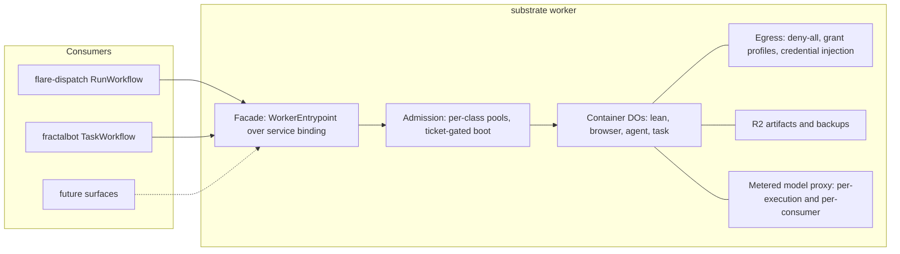

# The flare-dispatch substrate — execution environment for agentic work

The substrate is where FractalBox's agentic work runs: containers under a deny-all egress policy,
admission that owns the account's Containers ceiling, artifacts on R2, and metered model access. It
is a component of this repo (`apps/substrate`, its own worker — wrangler name
`flare-dispatch-substrate`, frozen at the first BYOC deploy), consumed by the dispatcher in-repo
and by **fractalbot** (the Slack conversational agent) from its own repo — and by any later
consumer. The substrate executes; it never decides what to run, never renders an outcome, and never
holds conversation or CI semantics.

The substrate is a **policy-and-audit layer over first-party Cloudflare primitives**, not sandbox machinery
of its own. Cloudflare Sandboxes (GA 2026-04-13) provide deny-by-default egress, dynamic per-instance
policy, TLS interception, and outbound-handler credential injection; Browser Rendering provides the
browser fleet. The substrate adds what the platform does not express: request-level grants asserted against
inputs no model authored, redirect re-policing, one enforced admission path, per-execution and
per-consumer budgets, approval attestation, and the audit trail — see the ADRs for each decision.

## Consumers and boundary

Consumers reach the substrate **only** through the facade ([ADR-0003](adr/0003-facade-only-consumption.md)):
`ensureSandbox` / `execUnderGrant` / `checkpoint` / `abort`, plus `admission.enqueue/attempt/release`
and `poolStatus()`. The boundary speaks plain structural types; Effect layers wrap consumer-side.
Verdicts, triggers, sinks, planners, and conversation state stay with the consumers
([ADR-0008](adr/0008-verdict-neutral-execution-facts.md)).

## Security floor

The stricter of the two consumers' threat models — hostile cloned code; every control holds without
model cooperation — is the floor for **all** workloads, CI included:

- Deny-all egress with named grant profiles; grants derive only from reviewed code, never dispatch
  inputs ([ADR-0005](adr/0005-deny-all-egress-with-grant-profiles.md)).
- No long-lived credential reachable from inside a container — writes leave via Worker-side writeback
  or handler-injected credentials; the per-execution model-proxy token is the one sanctioned
  carve-out ([ADR-0006](adr/0006-credential-boundary.md)).
- Irreversible commands require an approval attestation at the exec surface
  ([ADR-0007](adr/0007-approval-attestation-at-exec.md)).
- Execution tier and image class are policy-selected, never model- or payload-visible
  ([ADR-0010](adr/0010-named-image-classes-policy-selected.md)).
- The `@cloudflare/sandbox` + `@cloudflare/containers` pin is a security surface with a deploy-time
  canary ([ADR-0011](adr/0011-sdk-pin-as-security-surface.md)).

**Accepted residuals** (inherited from fractalbot's ADR-0005, restated so consumers start from
documented gaps): DNS exfiltration is uncovered; double-forked detached children survive
`killAllProcesses`; `git-upload-pack` is a bounded exfiltration sink.

**Never store, never log**: Slack bot tokens (never reach the substrate), GitHub installation tokens, secret
values, capability-token values, raw prompts beyond metering metadata. Authenticated clone URLs are
scrubbed from git remotes immediately post-clone; `.git` config is redacted at the artifact/checkpoint
capture chokepoint. Every egress denial is recorded as a per-execution event
`{host, method, path, reason, count}` retrievable with the execution's artifacts — and never surfaced
into the container.

### Read against the Agent Access Model

Cloudflare's [Agent Access Model](https://blog.cloudflare.com/the-agent-access-model/) proposes a
vocabulary for agent security that a reviewer may arrive with. We do not adopt its terms — it is a
reference architecture rather than a specification ("not a wire-level specification"), and our names
are the more precise ones for what is built here: an admission ticket gates capacity, which is not
what an identity broker does, and "the recipe is the grant source" carries a property ("never
model-authored") that "task template" does not. The mapping, so nobody has to reconstruct it:

| Agent Access Model | Here |
| --- | --- |
| Identity Broker → short-lived task-scoped credential | Admission ticket ([ADR-0004](adr/0004-admission-enforced-by-ticket.md)) — per (consumer, execution key, pool), TTL'd, and stored *into* the container rather than handed to the caller, so there is no credential in consumer hands to steal |
| Task-Scoped Access Engine | Grant derivation from the recipe ([ADR-0005](adr/0005-deny-all-egress-with-grant-profiles.md)) — asserted per request on method, path and body, not host scope alone |
| Mediation layer (harness and network) | The exec fence ([ADR-0003](adr/0003-facade-only-consumption.md)) and the outbound handler (ADR-0005) — one is structural, not a call-path convention |
| Task template | The recipe, with the stronger property that it is frozen from an input no model authored |
| Trust Ratchet | None. Grants are applied and revoked per execution, so there is no standing capability to narrow mid-task |
| Agent Activity Log | Execution facts ([ADR-0008](adr/0008-verdict-neutral-execution-facts.md)) plus per-execution denial events — not one queryable store, and not OCSF-shaped |
| Grant Review Loop | `legacy → report → enforce` (ADR-0005), which only widens — that ADR records the asymmetry |

Where it cites an actual standard rather than a concept — DPoP (RFC 9449), OAuth Token Exchange
(RFC 8693), OCSF, OpenTelemetry — the standard is named directly at the decision it bears on.

## Tenancy and deploy

Per-org BYOC, unchanged: an org deploys its dispatcher **and** its the substrate worker (the substrate first — the
dispatcher's service binding requires it), each from its own operator overlay under one upstream pin.
fractalbot remains a separate single-workspace deployable binding to the FractalBox org's substrate.

Deploy blast radius is the structural reason the substrate is its own worker: container DO classes live in
whichever worker defines them, and deploying that worker churns running containers. Product
iteration on the dispatcher or fractalbot must never kill long-lived work mid-run.

Patch distribution — the floor is only as good as the version an org runs: the substrate reports its version
on the health surface; security releases declare a minimum supported version on an advisory channel;
a substrate-only bump path exists so a security patch never queues behind a product release.

## Adoption plan

| Stage | Ordering constraint | What |
| --- | --- | --- |
| 1 | None — additive; the substrate not yet involved | Slack batch path lands in flare-dispatch (classification at fractalbot's ingress → HMAC re-dispatch) with enforced controls: `secrets: []` on slack origin, run allowlist excluding payload-command runs, config-pinned target repo. |
| 2 | Before untrusted or write-capable workloads share the fleet | The substrate is born: worker + facade + ticket-gated admission + the egress engine ported from fractalbot (`src/egress.ts`, `src/exec.ts`, `src/sandbox-policy.ts` — zero Cloudflare imports). flare-dispatch adopts the substrate: drain in-flight runs, then delete its container DO classes (state in the moving classes is disposable by design — leases live in D1, backups are cache) and consume the facade. SDK pair reconciled + canary live before consumer traffic. Deliverables: grant-profile catalog covering the run catalog, grant-authoring guide, generated facade API reference, BYOC upgrade runbook. Exit: every run's credentials ride writeback or proxy injection (`worker-deploy` is the acceptance case); every run graduated `legacy → report → enforce`. |
| 3 | After the facade API freezes | fractalbot binds: deletes `sandbox.ts`, image config, backup plumbing, its sandbox DO binding; keeps driver, planner, budgets, approval UX. Both its exec paths route through the substrate's approval check. |

Engineering ships at 10x; stages are risk-ordered, not effort-ordered — 1 and 2 run concurrently,
and 3 starts when the facade contract review lands.

## Success criteria

- A container boot without an admitted ticket fails closed (tested by calling `ensure()` directly);
  no `containers` stanza exists in any wrangler config except the substrate's.
- Zero secrets in container env across the consumer catalogs; `worker-deploy` ships on handler
  injection.
- Dogfood round-trips: a Slack mention triggers a dispatcher run whose verdict lands in-thread; a
  fractalbot task executes on the substrate with a mid-run approval.
- Docs shipped at stage-2 exit: facade API reference, grant-authoring guide, BYOC upgrade runbook.

## Open questions

- May BYOC operators author custom grant profiles, and behind what review gate ([ADR-0005](adr/0005-deny-all-egress-with-grant-profiles.md) defers this).
- Whether in-flight Workflows instances resume on new-deploy code (unverified platform behavior;
  affects consumer bake periods, not the substrate's contract).
