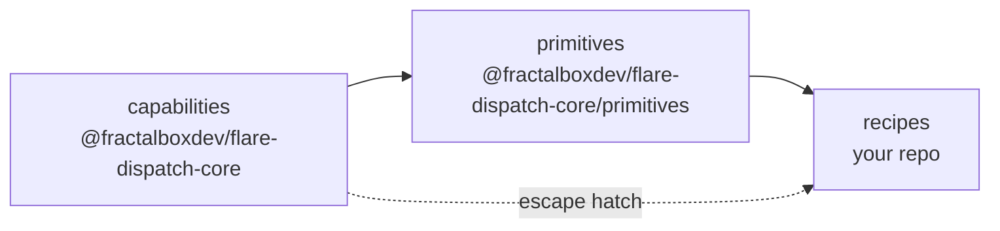

# @fractalboxdev/flare-dispatch-core

The FlareDispatch DSL — the typed Effect-TS surface that [runs](../../specs/02-runs.md) and [recipes](../../recipes/) are written against.

## The three tiers

`@fractalboxdev/flare-dispatch-core` ships the bottom two tiers; recipes are the third.



- **Capabilities** — `sandbox`, `browser`, `cache`, `artifact`, `io`, `config`, `github`. One `Context.Tag` service per namespace ([`src/services/`](src/services/)), each backed by a swappable Layer (real CF / local dev / in-memory test). A capability does one atomic thing.
- **Primitives** — reusable Effect-TS compositions built on the capabilities ([`src/primitives/`](src/primitives/)). Every recipe was re-deriving the same `acquire → clone → install` checkout dance, the indexed fan-out, the boot-and-wait preamble; a primitive is that shape, named once, typed once, tested once. A primitive adds **no new runtime** — only a smaller surface to write recipes against.
- **Recipes** — `defineRun` programs that ride on primitives and carry only the logic unique to one CI use case. The starter library is [recipes/](../../recipes/).

Full design: [specs/03-dsl.md](../../specs/03-dsl.md).

## Two entry points

```ts
import { defineRun, step, sandbox, artifact } from "@fractalboxdev/flare-dispatch-core";
import { workspace, sharded } from "@fractalboxdev/flare-dispatch-core/primitives";
```

The split keeps the layer boundary visible at the top of every recipe file. The `exports` map in [`package.json`](package.json) declares both.

## Layout

| Path | Holds |
|---|---|
| [`src/define-run.ts`](src/define-run.ts) | `defineRun` constructor + `Run` / `RunLimits` / `TriggerSpec` types |
| [`src/step.ts`](src/step.ts) | `step` checkpoint + the `runEffect` Workflow-boundary shim |
| [`src/errors.ts`](src/errors.ts) | tagged `RunError` classes |
| [`src/context.ts`](src/context.ts) | `RunContext` — the capability-service union |
| [`src/services/`](src/services/) | one capability per file — `Context.Tag` + interface + accessor namespace |
| [`src/primitives/`](src/primitives/) | the reusable compositions (catalogue below) |

### Primitive catalogue

| Primitive | Does | Built from | Used by |
|---|---|---|---|
| [`workspace`](src/primitives/workspace.ts) | Acquire a container + clone a repo (+ optional cached install) | `sandbox`, `installCached` | every recipe |
| [`installCached`](src/primitives/install-cached.ts) | R2-backed dependency install, keyed on the lockfile hash | `cache`, `sandbox` | `workspace`, browser-tests |
| [`sharded`](src/primitives/sharded.ts) | Count-and-index parallel fan-out | `Effect.forEach` | test-matrix, browser-tests |
| [`bootApp`](src/primitives/boot-app.ts) | Start a detached process and wait for its port | `sandbox` | cdp-acceptance |
| [`probeHttp`](src/primitives/probe-http.ts) | Hit a set of URLs and classify each healthy / failed | `sandbox` | deploy-smoke |

A new primitive earns its place when a shape recurs across **two or more** recipes — full rule in [03-dsl § Adding a primitive](../../specs/03-dsl.md#adding-a-primitive).

## Distribution

`@fractalboxdev/flare-dispatch-core` is a library — pinned, not copied. Primitives ship inside it as the `./primitives` sub-path rather than as copy-paste scaffolding, because they are a sub-path of a package every recipe already trusts for `defineRun` / `step`: copying them out shrinks the trusted set by nothing and only makes them un-patchable. Rationale, the opt-in `eject` escape hatch, and the supply-chain surface that actually matters are in [03-dsl § Distribution and supply chain](../../specs/03-dsl.md#distribution-and-supply-chain).

> **Status:** pre-implementation. These files are spec-grade source — the canonical home for the API the [specs](../../specs/) describe and the [recipes](../../recipes/) import. The runtime Layers that back the capabilities land with the V0 build ([pm/plan.md](../../specs/pm/plan.md)).
