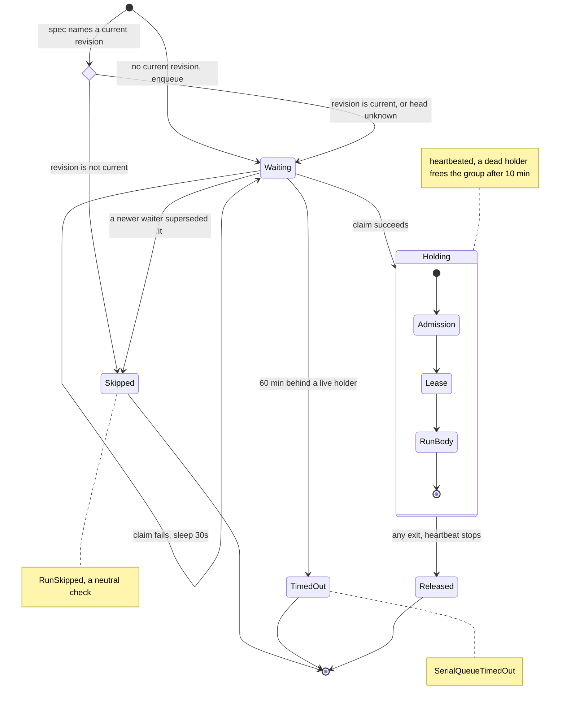
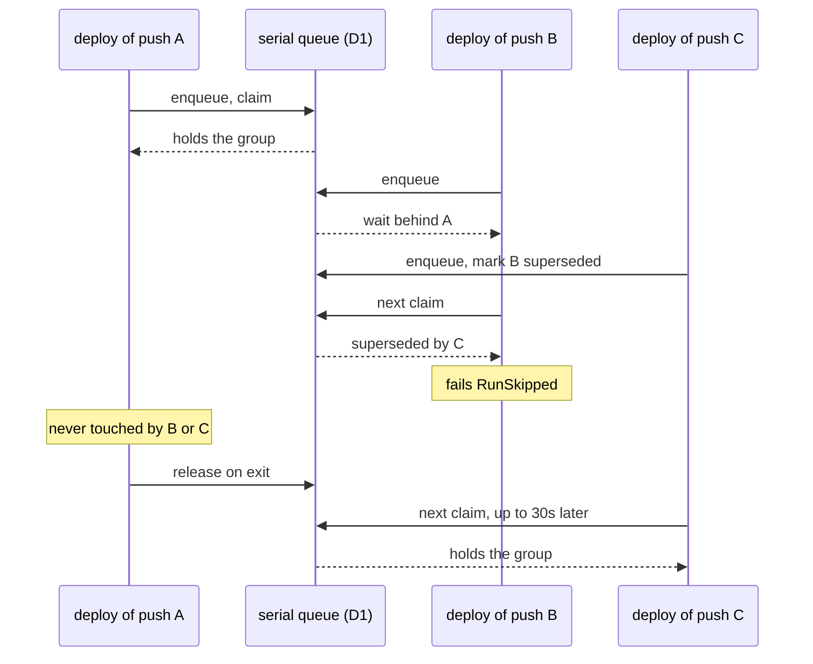

# ADR-0004 — Serialized run groups: one in flight, newest waiter wins, in D1

**Status:** proposed 2026-09-18
**Related:** `packages/runtime-cf/src/serial-queue-d1.ts` · `apps/flare-dispatch-app/src/workflow.ts` · `apps/flare-dispatch-app/src/runs/worker-deploy.ts` · `infra/migrations/0008_serial_queue.sql` · ADR-0001 § Consequences ("No per-entity mutex")

## Context

`worker-deploy` fires on every default-branch push. Two pushes close together
produce two concurrent executions, and completion order is not push order: an
older commit's deploy can finish minutes after a newer one's and leave
production on the older commit. A command cannot guard itself, because the
sandbox checkout's `origin` carries no credential after the clone, so
`git ls-remote` fails on a private repo.

ADR-0001 records that runs have no per-entity mutex — instance-id dedup, cooldown,
the container lease, and admission are dampers, not serialization. A deploy needs
serialization.

## Decision

A run may declare `serialize: (input) => { group, revision, current? } | undefined`.
For executions with equal `group`:

- at most one runs;
- when the spec names a `current` revision (for a deploy, the branch head), it
  is read once before the execution touches the queue. An arrival whose
  revision is not current fails `RunSkipped` at once and supersedes nothing. An
  arrival whose revision is current supersedes every waiter whose revision is
  not, whenever that waiter arrived;
- otherwise a new arrival marks every older waiter superseded in the same D1
  batch that enqueues it, so the only live waiter is the newest; a superseded
  waiter fails `RunSkipped` (a `neutral` check naming the newer revision);
- a running execution is never touched by a newer one;
- a waiter queued past 60 minutes behind a live holder fails
  `SerialQueueTimedOut`.

The gate runs in `RunWorkflow` before admission, so a waiter holds no pool slot,
and the group is heartbeated through admission, the lease, and the run body.
State lives in one D1 table on the existing `RUNS_METADATA` binding.

One execution's path through the gate:

Three pushes to one branch in quick succession:

`worker-deploy` groups by repo, branch, and `checkLabel`, and after it holds its
group reads the branch head through the GitHub App: a head that is not the
dispatched SHA skips the deploy; the head is also exported to the command.

## Options considered

- **D1 table (chosen).** Writes serialize per database, so one conditional
  UPDATE is an atomic claim — the property `run_admissions` and
  `container_leases` already rely on. No new binding, no Durable Object
  migration, and the poll loop hibernates in `step.sleep`. Cost: waiters poll
  (every 30s, ≤121 claim steps), so a freed group is taken up to 30s late.
- **A Durable Object per group.** Single-threaded, can push "your turn" instead
  of being polled. Lost on operating cost: a new class, a wrangler migration tag,
  and a second store for the same queue semantics D1 already provides in this
  codebase. Worth revisiting if poll latency or step count matters.
- **KV.** No compare-and-set and eventually consistent; two waiters can both
  believe they hold the group. Rejected on correctness.
- **Cancel the in-flight deploy when a newer one arrives.** A killed deploy may
  have published some Workers and not others. Rejected on correctness.

## Criteria

Correctness of "never two in flight" under concurrent webhooks decided it; zero
new infrastructure broke the tie between D1 and a Durable Object.

## Consequences

- Deploy latency for a burst: the newest push waits for the in-flight deploy,
  then up to one poll interval.
- Every serialized `worker-deploy` dispatch makes one GitHub API call before it
  queues, and another at dequeue. A late or re-requested older commit skips
  without displacing the head's waiting deploy.
- When the head read fails, the group falls back to arrival order, and an older
  commit arriving after a newer one can supersede it; the dequeue-time head
  check then skips the older commit too, and the head waits for the next
  dispatch.
- A holder that dies without releasing blocks its group until its heartbeat
  stales (10 minutes).
- Any run can opt in; each one that does documents its group key.

## Revisit triggers

- A second run needs serialization with ordering by something other than arrival.
- Poll latency or step count becomes visible in deploy times or billing.
